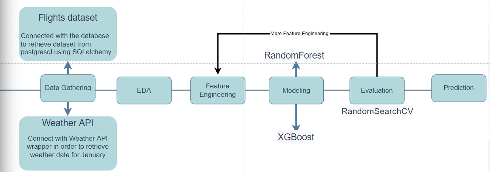

# Mid-Term Project
This repository contains a model for predicting 2020 January flight delay based on data from 2018 and 2019

## Hello and Welcome!!!

## Author:  
* Olivia Han 
* Ripudaman Singh Bevli

The goal is to predict arrival delays of commercial flights. Often, there isn't much airlines can do to avoid the delays, therefore, they play an important role in both profits and loss of the airlines. It is critical for airlines to estimate flight delays as accurate as possible because the results can be applied to both, improvements in customer satisfaction and income of airline agencies.

### Files
- **WeatherAPI.ipynb**:This file contains the codes of getting the data from the weather api
- **WeatherAPI_city_renaming.ipynb**:This file renaming the cities of the weather api in order to merge the weather data to the original dataset
- **Merge_Weather_Data.ipynb** :This file is to merge the weather information to the dataset
- **EDA.ipynb**: This file contains our initial exploratory data analysis
- **Flight_delay_prediction.ipynb**:This file contains our EDA, feature engineering, modeling, evaluation and final testing
- **Flights_test.ipynb**: This file contains the codes we manipulate with the final dataset with our features: weather and information about historical delays
- **submission.csv**: this file is the final submission contain our prediction for Jan 2020 flight delay.
Flights_test.ipynb

## Project WorkFlow

## Feature Engineering
* Weather Data: 
    * Creating categorical features based on the weather, visibility and windspeed of origin and destination airport. 
* Flight Data: 
    * Calculate the previous average arrival delay for each pair of departure and destination airports
